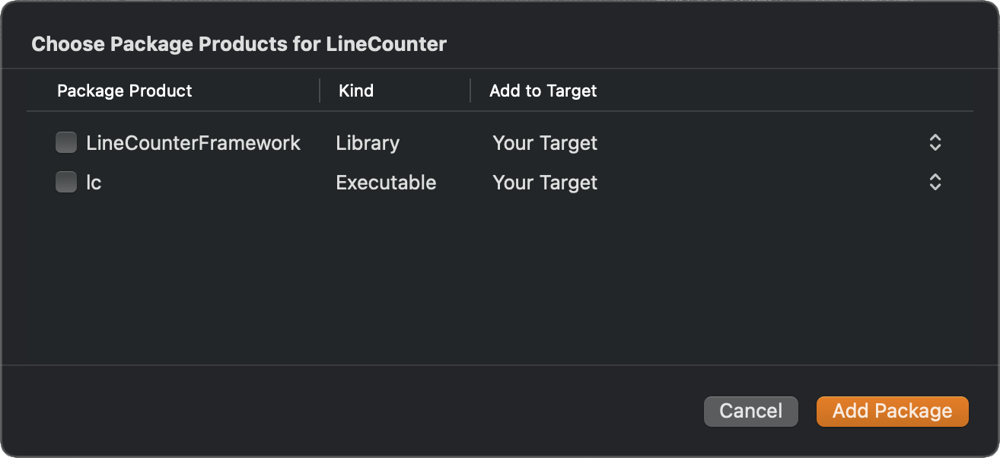
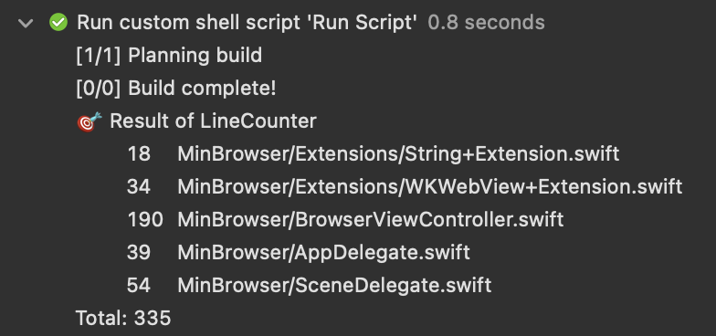

# LineCounter

LineCounter は指定したファイルまたはディレクトリ内のファイルの行数を数える Command Line Tool です。

## インストール方法

```sh
$ git clone https://github.com/Kyome22/LineCounter.git
$ cd LineCounter
$ swift build -c release
$ sudo cp .build/release/lc /usr/local/bin/lc
```

## 使い方

```sh
$ lc --help
```

でコマンドの使い方が出力されます。

```sh
$ lc -p [対象のパス]
```

とすれば、ファイルの場合はその行数を、ディレクトリの場合はそのディレクトリに含まれるファイルを再起的に探索してそれぞれの行数を出力します。

複数のパスを指定したい場合は、

```sh
$ lc -p [対象のパス] -p [対象のパス] -p [対象のパス]
```

のようにパスごとに引数を指定すればよいです。

また、

```sh
$ lc -p [対象のパス] -e [拡張子]
```

とすれば、行数をカウントするファイルの種類を指定できます。

`--no-warnings` フラグを付ければ、行数のカウントをスキップしたファイルや読み込み不可なファイルのログを省略できます。

## プロジェクトへの導入方法

1. Swift Pacakge Manager で LineCounter を Add します。

   

2. Target 内では使用しないため、Choose Package Products for LineCounter はチェックをつけずにスルーします。

   

3. Target の Build Phase に Run Script を追加します。

   

   ```sh:スクリプトの例
   # プロジェクトのルートディレクトリ以下のSwiftファイルの行数をカウントする
   xcrun --sdk macosx swift run \
     --package-path ${BUILD_DIR%Build/*}SourcePackages/checkouts/LineCounter \
     lc -p ./${SRCROOT} -e swift --no-warnings
   ```

これで Build するたびに行数のカウントが実行されます。


