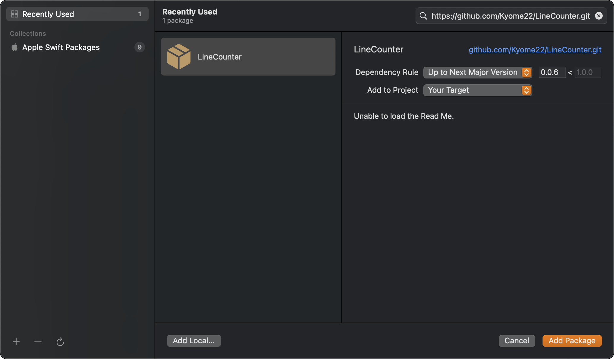
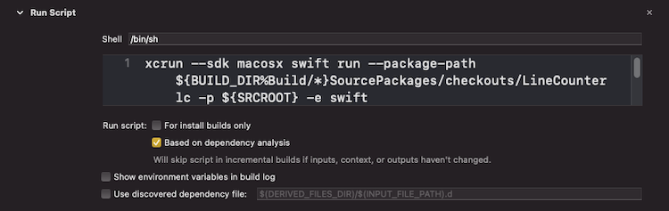

# LineCounter

LineCounter は指定したファイルまたはディレクトリ内のファイルの行数を数える Command Line Tool です。

## 使い方

clone したルートディレクトリで

```sh
$ swift run lc -p [対象のパス]
```

とすれば、ファイルの場合はその行数を、ディレクトリの場合はそのディレクトリに含まれるファイルを再起的に探索してそれぞれの行数を出力します。

複数のパスを指定したい場合は、

```sh
$ swift run lc -p [対象のパス] -p [対象のパス] -p [対象のパス]
```

のようにパスごとに引数を指定すればよいです。

また、

```sh
$ swift run lc -p [対象のパス] -e [拡張子]
```

とすれば、行数をカウントするファイルの種類を指定できます。

## プロジェクトへの導入方法

1. Swift Pacakge Manager で LineCounter を Add します。
   

2. TARGET の Build Phase で Run Script を追加します。
   

   ```sh:スクリプトの例
   # プロジェクトのルートディレクトリ以下のSwiftファイルの行数をカウントする
   xcrun --sdk macosx swift run --package-path ${BUILD_DIR%Build/*}SourcePackages/checkouts/LineCounter lc -p ${SRCROOT} -e swift
   ```

これで Build するたびに実行されます。
