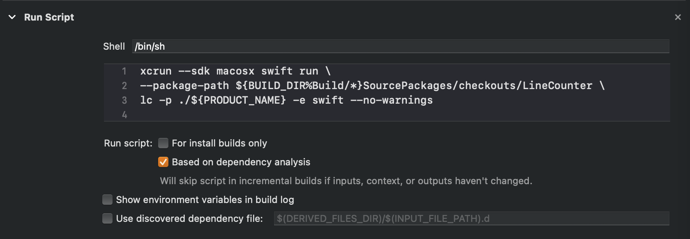

# LineCounter

LineCounter は指定したファイルまたは指定したディレクトリ内のファイルの行数を数える Command Line Tool です。

# 使い方

clone したルートディレクトリで

```bash
$ swift run lc -p [対象の絶対パス]
```

とすれば、ファイルの場合はその行数を、ディレクトリの場合はそのディレクトリに含まれるファイルを再起的に探索してそれぞれの行数を出力します。

```bash
$ swift run lc -p [対象のパス] -e [拡張子]
```

とすれば、行数をカウントするファイルの種類を指定できます。

# Project への導入方法

1. Swift Pacakge Manager で LineCounter を Add します。
   

2. TARGET の Build Phase で Run Script を追加します。
   

```bash:Scriptの例
# コマンドラインツールのあるディレクトリに移動
cd ${BUILD_DIR%Build/*}SourcePackages/checkouts/LineCounter

# コマンドを実行
# ルートディレクトリ以下のSwiftのコードを指定
xcrun --sdk macosx swift run lc -p ${SRCROOT} -e swift
```

これで Build するたびに実行されます。
